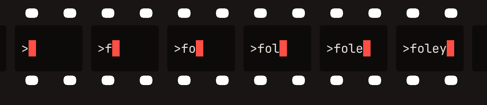
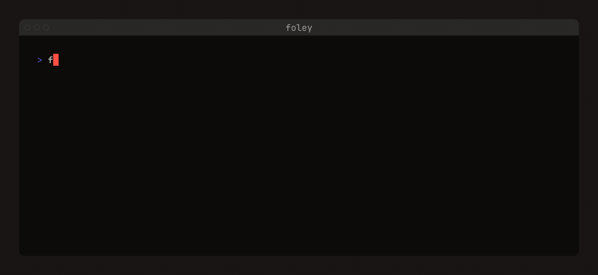
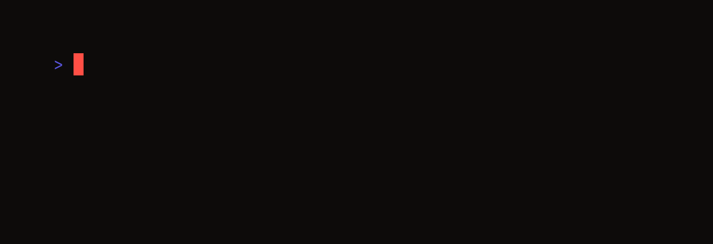
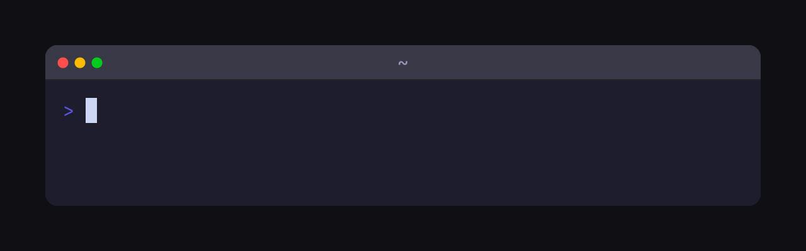
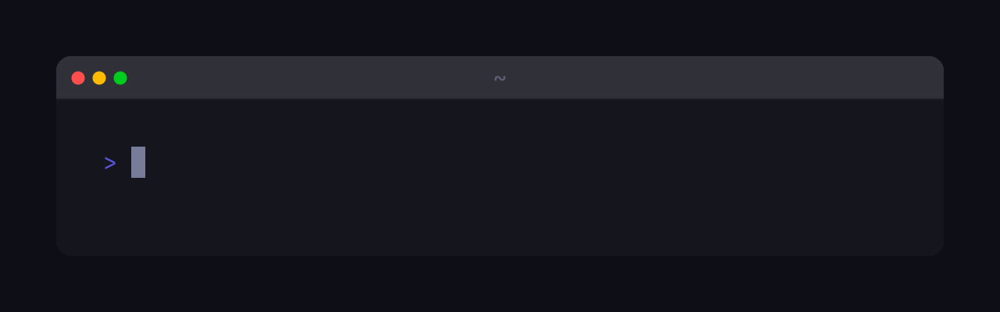
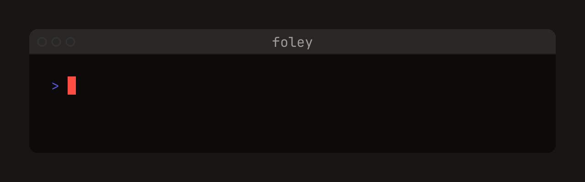
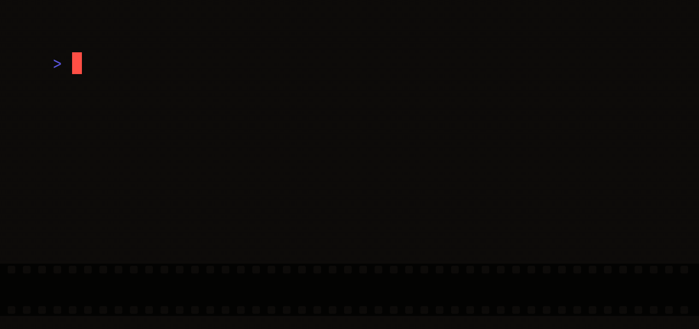
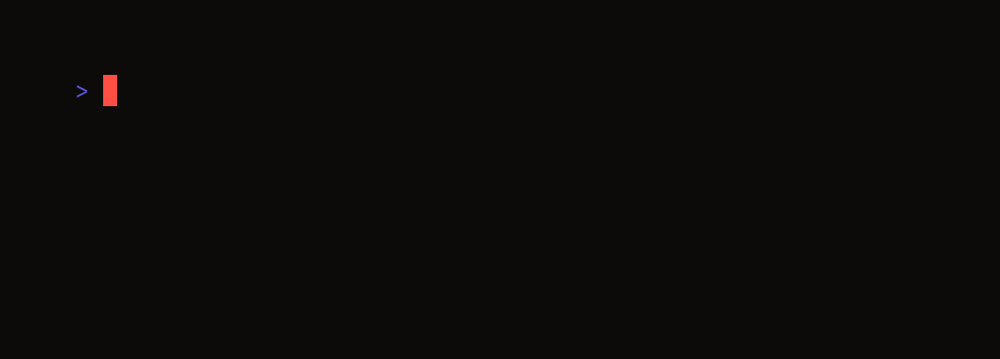
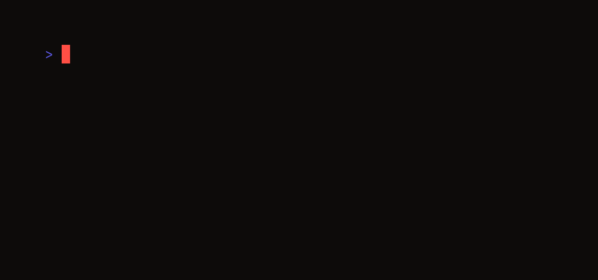
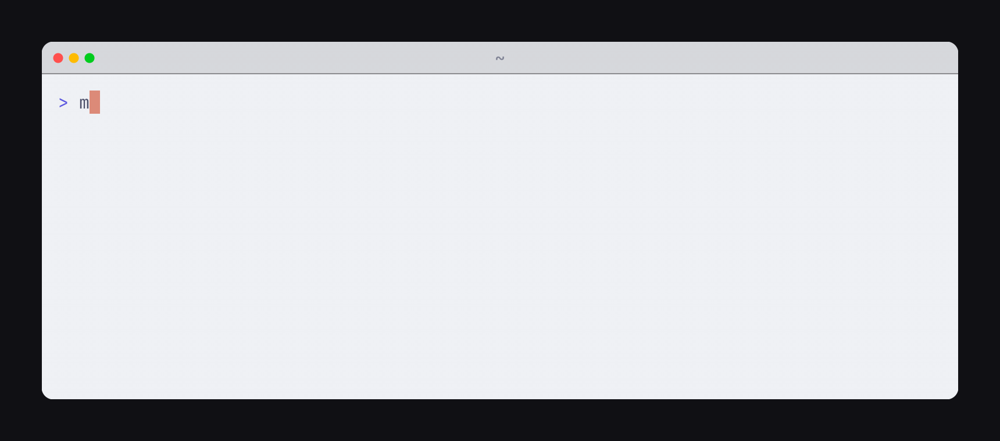

<p align="center">
  
</p>

# foley

> In film, a foley artist recreates sound in the studio, with real objects instead of set recordings.
> Foley recreates the terminal in the studio, with your real app instead of a screen recording.

foley renders terminal demos from VHS-style `.tape` scripts — without opening a terminal window. Your app runs on a real pty, an embedded terminal engine (libghostty-vt, the brain of [Ghostty](https://ghostty.org)) keeps the screen, and foley draws every frame itself.

<p align="center">
  
</p>

<sub>Nothing in this shot is a mockup: that is a real `fastfetch` on a real pty, and the `Terminal: foley` line is genuine — foley <b>is</b> the terminal the demo runs in.</sub>

## The stubborn route

foley started as one demo I couldn't record. I was building a TUI that draws pixel art straight into the terminal, went looking for a recorder, and found [VHS](https://github.com/charmbracelet/vhs) — which won me over on sight: write the demo as code, a `.tape` script instead of a shaky screen recording. I still think that model is exactly right. But my app speaks the kitty graphics protocol, and those pixels never arrived on the recording — the screen being filmed didn't speak it. I wanted the tape workflow anyway, so I took the stubborn route: render the terminal myself.

That one decision turned out to carry the whole project. When the frame is yours from the pty up, things stop being features you bolt on and start being consequences of the architecture:

- foley is the one pressing the keys, so an input reel under the window is almost free — the track is *emitted* with exact timing, not captured and guessed at.
- every take renders from a supersampled master, so a camera is just arithmetic: push onto a region, hold, pull back, and the zoom is a 1:1 crop that is never blurry.
- the clock is virtual, so the same tape produces byte-identical output on any machine — demos double as visual regression tests — and a ~32-second script exports in under 5.
- the recording never touches your real session, so one cue builds a closed set per take: fresh HOME, fresh paths, and your machine stays off camera.
- nobody else is hired to draw the screen — no browser offstage, no display server on set — so takes render headless anywhere CI runs, and the whole studio ships as a 72 MB container.
- a finished take is just frames, so it screens anywhere: a gif in a README, an asciicast, golden text for CI, or live in your own terminal.
- and the kitty graphics that started all this render byte-exactly, because the engine underneath is a real terminal's.

So that's foley: VHS's authoring model, kept whole, plus the post-production that a rendered terminal makes possible.

## Setting up the studio

A studio gets built once. foley needs `ffmpeg`, and for now builds from source — Go 1.26+, with Docker for the one-time engine build:

```sh
git clone https://github.com/GH-Jaider/Foley && cd Foley
make engine-lib fonts                       # pinned libghostty-vt + pinned fonts
go install -tags ghosttyvt ./cmd/foley
export FOLEY_FONTS="$PWD/internal/fontpack/fonts"
```

When in doubt, `foley doctor` checks fonts, engine and ffmpeg.

## The script — a `.tape`

A demo is written before it is recorded. The script is a `.tape` file — settings, keystrokes, waits — and the grammar is VHS's own, vendored from the pinned release ([VHS's reference](https://github.com/charmbracelet/vhs#vhs-command-reference) documents all of it):

```elixir
Output demo.gif
Set Shell bash
Set FontSize 15

Type "echo hello, foley"
Enter
Sleep 2s
```

**Every VHS tape is a foley tape.** The upstream example corpus — all 106 tapes — parses and runs under conformance tests, and where foley differs on purpose (pinned fonts, an internal clipboard), it says so loudly at run time instead of silently drifting.

```sh
foley new demo.tape        # a starter tape to edit
foley validate demo.tape   # the spotting session: lint + cue sheet, nothing records
foley -watch demo.tape     # re-record every time you save
foley manual               # the manual, right in the terminal — cues included
```

## The take — a terminal with no window

```sh
foley demo.tape            # record the tape's outputs
```

One command calls action and the whole take rolls. There is no window to arrange and no capture to babysit: the terminal exists only inside the renderer, so nothing asks for a screen-recording permission and no stray notification ever walks through a shot. When the last step finishes, every `Output` the tape declares is written.

### Two clocks

Time on set passes one of two ways. **Deterministic** (the default) is a virtual clock: output is attributed to the step that caused it, every run of a tape produces identical bytes, and rendering runs faster than real time. **Realtime** rolls on the wall clock and captures every byte as it happened — the clock a continuously animating TUI needs (`-mode realtime`). Honest limits either way: waits synchronize against the real app, so they spend the time they spend.

→ pixel art living in the terminal, recorded in realtime: [examples/kitty-graphics/tenten](examples/kitty-graphics/tenten)

### `studio` — a closed set

Direction in foley is written as comments in the tape — cues, the whole next section. One cue, though, belongs to the set rather than to the footage:

```elixir
# foley: studio
```

HOME, the working directory and every temp default move to a fresh stage, struck when the take ends — your dotfiles, your paths and your username never make it on camera, and the take leaves nothing behind:

<p align="center">
  
</p>

<sub><code>foley@studio</code> is nobody's real machine — the set is built fresh for the take and struck when it ends.</sub>

Your prompt is part of the set too: `Env PS1` wins over the pinned shell prompt, and a bare `Wait` learns the new one automatically.

→ your prompt, your rules: [examples/prompt](examples/prompt)

## Post-production — the `# foley:` cues

The tape is the recording; foley adds the post-production — and the footage is never touched. Cues are the director's notes in the margins of the script: each one names a piece of the scene for foley to recreate — wardrobe, camera, where the viewer should look — and they are written as comments:

```elixir
# foley: dress macos
# foley: zoom 0,1 40x9 600ms
```

Because they are comments, VHS ignores them: the same tape still runs there — cues only ever add. Inside the namespace they are strict (a typo is a parse error, never a silent no-op). `dress` and `keys` shape the whole take, `highlight` and `zoom` act at their position in the script, and `studio` — the closed set above — is the one cue that works on the set instead of the footage. `foley validate` prints the cue sheet before anything records.

### `dress` — one take, many looks

A dress is the window's whole wardrobe — theme, bar, padding, margins — as one named layer. The tape never changes:

```sh
foley -dress macos demo.tape
foley -dress noir  demo.tape
```

<p>
  
  
</p>

<sub>The same take, recorded twice — between the two commands, only the flag changed.</sub>

`foley wardrobe` lists the built-ins, `foley sew` cuts a new one. The window bar behaves like a real terminal's — when the app declares its title (OSC 2), the bar follows it on camera:

<p align="center">
  
</p>

<sub>That isn't vim — it's a <code>printf</code> declaring vim's title. The bar can't tell either.</sub>

→ every built-in, on the same take: [examples/dresses](examples/dresses)

### `keys` — the input reel

```elixir
# foley: keys
```

Every keystroke lands on the film strip under the window, with its exact timing — recall, chords, all of it. This is the namesake's own trade: a performance track, laid under the footage in perfect sync by the one who performed it:

<p align="center">
  
</p>

<sub>The strip is emitted with the input, not read off the pixels — that <code>Ctrl+C</code> lands exactly when it was pressed.</sub>

→ the reel over a real TUI: [examples/keys](examples/keys)

### `highlight` — point the viewer's eye

```elixir
# foley: highlight /FAIL.*/
Sleep 2s
# foley: highlight off
```

A band of the theme's own selection color, from that beat of the script until `off`:

<p align="center">
  
</p>

<sub>The <code>FAIL</code> is a prop, staged for this shot — the real run is one link down.</sub>

→ a real test run: [examples/highlight](examples/highlight)

### `zoom` — the camera

```elixir
# foley: zoom 0,1 40x9 600ms
Sleep 2s
# foley: zoom off 600ms
```

Push onto a region, hold, pull back. `0,1` is the framed region's top-left cell and `40x9` its size — cells, 0-based, the same standard `highlight` uses. The `600ms` is the length of the move, and it's optional (the house default is exactly that); there is no easing knob — the duration is the shot. `zoom off` pulls back the same way:

<p align="center">
  
</p>

<sub>The push-in is a 1:1 crop of the supersampled master — that's why the hold stays crisp.</sub>

→ the camera over tmux panes: [examples/zoom](examples/zoom)

### Dark/light pairs — one tape, two palettes

`-theme` replaces the recording's palette without editing the tape — record it twice and let GitHub pick per viewer:

```sh
foley -theme "Catppuccin Mocha" -o dark.gif  demo.tape
foley -theme "Catppuccin Latte" -o light.gif demo.tape
```

```html
<picture>
  <source media="(prefers-color-scheme: dark)" srcset="dark.gif">
  
</picture>
```

<picture>
  <source media="(prefers-color-scheme: dark)" srcset="examples/pair/dark.gif">
  
</picture>

<sub>Which palette you're seeing right now depends on your GitHub theme — same tape either way.</sub>

→ [examples/pair](examples/pair)

## The screening — outputs

The finished take screens right where you are — in your own terminal, over kitty graphics:

```sh
foley play demo.tape    # record, then watch it right here
```

For every other venue, format follows the extension, straight from the tape's `Output` lines or `-o`:

| Extension | What you get |
|---|---|
| `.gif` / `.mp4` / `.webm` / `.webp` | video, encoded reproducibly (`-gif-loop`, `-output-scale` to trade weight for crispness) |
| `.cast` | [asciicast v2](https://docs.asciinema.org/manual/asciicast/v2/) — the raw byte stream for asciinema players |
| `.txt` | the final screen as text — golden files for CI |
| `.png` | `Screenshot` frames along the way |
| a directory | every frame as PNG + a timing manifest |

## Demos as tests

A take can be reshot forever, byte for byte — which turns demos into tests: record a `.txt` (or the gif itself) as a golden file and diff it on every push; if a frame changes, something changed it. foley's own CI records the same tape on macOS and Linux and compares the frames by hash. For pipelines there is a container image (72 MB: the binary, ffmpeg, bash and the fonts).

## The library

foley is a Go library first; the CLI is a thin door over it:

```go
import (
    "github.com/GH-Jaider/foley"
    "github.com/GH-Jaider/foley/key"
)

rec, err := foley.New(foley.Options{Command: []string{"bash"}, Cols: 80, Rows: 24})
defer rec.Close()

rec.Type(ctx, "echo hello, foley", 50*time.Millisecond)
rec.Press(ctx, key.Named(key.NameEnter), 0)
rec.Sleep(ctx, 2*time.Second)
rec.Output(ctx, "demo.gif")
```

Everything the CLI does — cues, dresses, the camera — is public API (`tape.Run` executes whole tapes). Error handling elided above.

## The CLI

| Command | What it does |
|---|---|
| `foley demo.tape` | record the tape's outputs |
| `foley play` | record, then screen it in your own terminal via kitty graphics |
| `foley validate` | lint + cue sheet, nothing records |
| `foley new` / `foley sew` | scaffold a tape / a dress |
| `foley themes` / `fonts` / `wardrobe` | the catalogs |
| `foley manual` | the manual — commands, settings and cues, in the terminal |
| `foley doctor` | check fonts, engine and ffmpeg |
| `foley completion bash\|zsh\|fish` | shell completions |

Flags go before or after the tape path; `foley -h` is the grouped reference.

## The grammar — at a glance

A tape speaks these commands — plus foley's cue layer on top:

- `Output <path>` — specify file output
- `Require <program>` — specify required programs for tape file
- `Set <Setting> Value` — set recording settings
- `Type "<characters>"` — emulate typing
- `Left` `Right` `Up` `Down` — arrow keys
- `Backspace` `Enter` `Tab` `Space` — special keys
- `ScrollUp` `ScrollDown` — scroll terminal viewport
- `Ctrl[+Alt][+Shift]+<char>` — press control + key and/or modifier
- `Sleep <time>` — wait for a certain amount of time
- `Wait[+Screen][+Line] /regex/` — wait for specific conditions
- `Hide` — hide commands from output
- `Show` — stop hiding commands from output
- `Screenshot <path>` — screenshot the current frame
- `Copy` / `Paste` — copy and paste text from clipboard
- `Source <tape>` — source commands from another tape
- `Env <Key> Value` — set environment variables
- `# foley: dress|keys|highlight|zoom|studio` — the cues: post-production direction, each documented above

→ usage and examples for every command: [VHS's reference](https://github.com/charmbracelet/vhs#vhs-command-reference) · in your terminal: `foley manual`

## Examples

The [examples gallery](examples/) holds the full takes: real tools (tmux, lazygit, lf, fastfetch, git), image previews over kitty graphics, and the tapes that recorded everything you see on this page — each one regenerable with `make examples`. Syntax highlighting for `.tape` files: [VHS's tree-sitter grammar](https://github.com/charmbracelet/tree-sitter-vhs) works as-is (same grammar).

## Credits

- **[VHS](https://github.com/charmbracelet/vhs)**, by [Charm](https://charm.sh) — this project was born inside its world and never left: the tape format is theirs (vendored grammar, MIT), the upstream examples run in foley's test suite, and the shell and theme tables mirror the pinned release on purpose. ♥
- **[Ghostty](https://ghostty.org)** — libghostty-vt is the terminal brain behind every frame.
- The pinned font catalog: JetBrains Mono, Fira Code, IBM Plex Mono, Source Code Pro, Hack, Ubuntu Mono (each under its own open license, hash-verified).

## License

[MIT](LICENSE)
