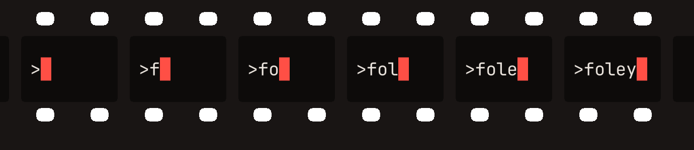
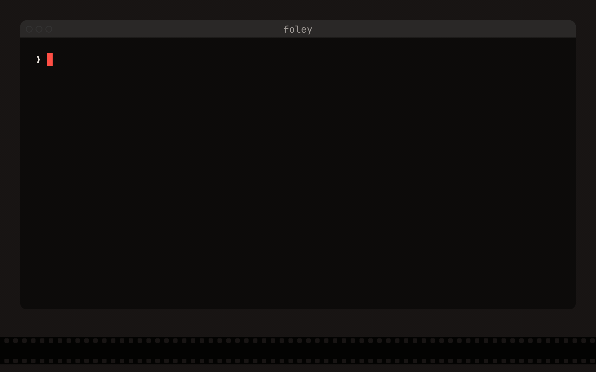
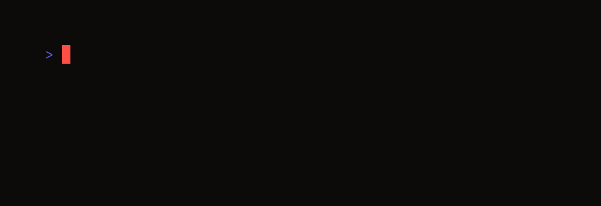
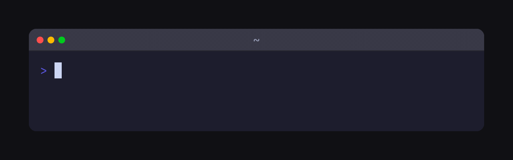
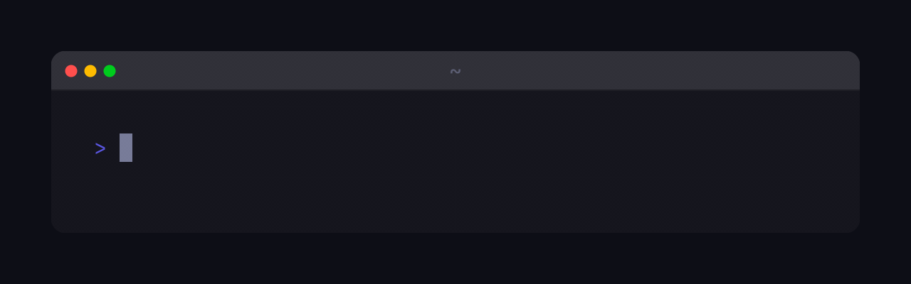
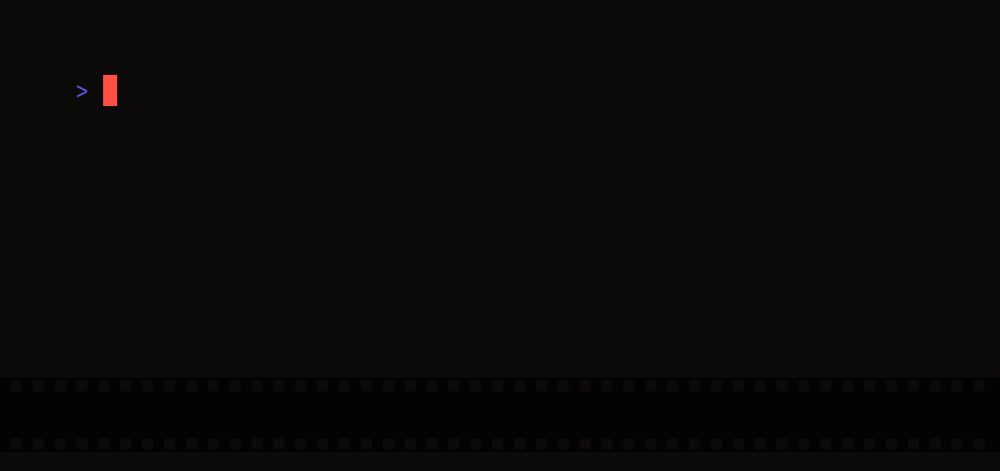
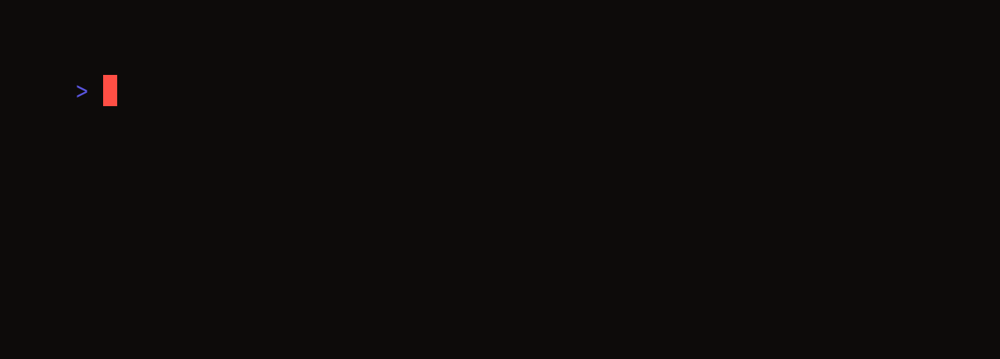
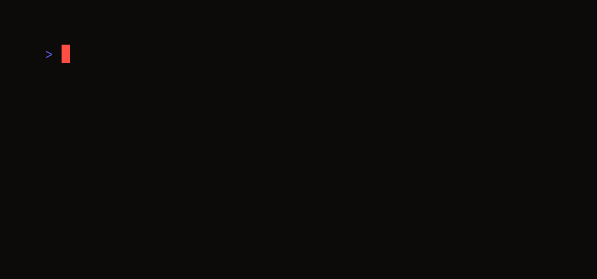
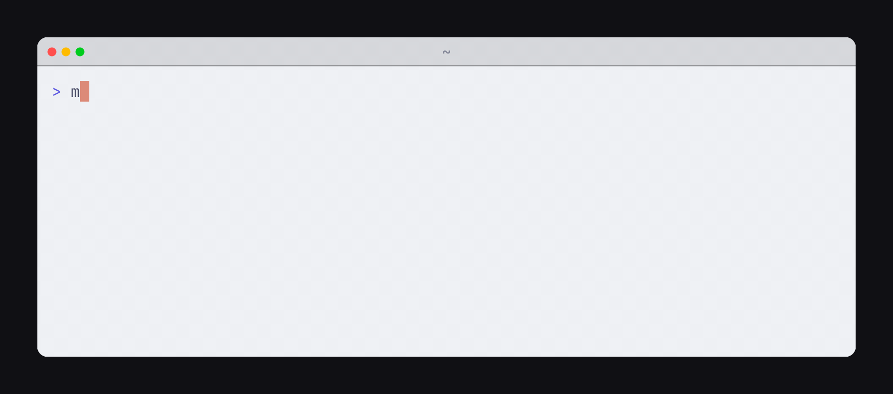

<p align="center">
  
</p>

# foley

<p align="center">
  <a href="https://pkg.go.dev/github.com/GH-Jaider/foley"></a>
  <a href="https://github.com/GH-Jaider/foley/actions/workflows/ci.yml"></a>
  <a href="https://github.com/GH-Jaider/foley/releases"></a>
  <a href="https://gh-jaider.github.io/foley/"></a>
  <a href="LICENSE"></a>
</p>

> In film, a foley artist recreates sound in the studio, with real objects instead of set recordings.
> foley recreates the terminal in the studio, with your real app instead of a screen recording.

foley renders terminal demos from VHS-compatible `.tape` scripts, with no terminal window and no screen capture. Your app runs on a real pty, an embedded terminal engine ([libghostty-vt](https://ghostty.org), the brain of Ghostty) keeps the screen, and foley draws every frame itself: gif, mp4, webm, webp or asciicast, byte-identical on any machine.

<p align="center">
  
</p>

<sub>One take, no window anywhere. The tape that shot it: <a href="examples/showcase">examples/showcase</a>. The full story of why foley renders instead of recording: <a href="https://gh-jaider.github.io/foley/story.html">the website</a>.</sub>

## Install

```sh
brew install GH-Jaider/foley/foley   # macOS and Linux, brings ffmpeg with it
```

<details>
<summary>Prebuilt binary, or build from source</summary>

**Prebuilt binary.** Grab the tarball for your platform from the [latest release](https://github.com/GH-Jaider/foley/releases), then:

```sh
tar xzf foley_*_$(uname -s | tr A-Z a-z)_*.tar.gz
sudo mv foley /usr/local/bin/          # or anywhere on your PATH
```

**From source.** Needs Go 1.26+ and Docker for the one-time engine build:

```sh
git clone https://github.com/GH-Jaider/foley && cd foley
make engine-lib fonts                  # pinned libghostty-vt (your platform) + pinned fonts
go install -tags "ghosttyvt embedfonts" ./cmd/foley
```

If `go install` complains about the Go version, `GOTOOLCHAIN=auto go install` fetches the pinned toolchain.
</details>

The binary is self-contained (engine and fonts baked in); ffmpeg is the one runtime need. When in doubt, `foley doctor`.

## Quick start

```sh
foley new demo.tape        # a starter tape to edit
foley validate demo.tape   # the spotting session: lint + cue sheet, nothing records
foley demo.tape            # record every Output the tape declares
foley play demo.tape       # record, then watch it in your own terminal
```

A tape is settings, keystrokes and waits; the grammar is VHS's own, vendored from the pinned release. **Every VHS tape is a foley tape**: the upstream corpus, all 106 tapes, runs under conformance tests, and where foley differs on purpose it says so loudly at run time. `foley manual` documents every command and cue; [VHS's reference](https://github.com/charmbracelet/vhs#vhs-command-reference) covers the shared grammar.

Agents write tapes too. [`foley.md`](foley.md) is the agent-facing manual: the whole grammar, every cue, the CLI and the authoring loop in one file any agent loads as context. The binary carries it, so no repo checkout is needed:

```sh
foley skill > foley-skill.md   # save it wherever your agent loads instructions
```

## Why render instead of record

When the frame is yours from the pty up, the big features are consequences, not add-ons:

- **Byte-identical takes.** The clock is virtual: the same tape produces identical bytes on any machine, and renders faster than real time (a ~32-second script exports in under 5).
- **A camera that never blurs.** Every take renders from a supersampled master; the zoom is a 1:1 crop.
- **An honest input reel.** foley presses the keys, so the track is emitted with exact timing, not captured and guessed at.
- **Headless anywhere.** No browser offstage, no display server on set: takes render wherever CI runs.
- **Kitty graphics, byte-exact.** The engine underneath is a real terminal's.

## The cues

Direction is written as `# foley:` comments in the tape. VHS ignores them; foley composites them over the render, never over the footage. `foley validate` prints the cue sheet.

### `studio`, a closed set

```elixir
# foley: studio
```

HOME, the working directory and every temp default move to a fresh stage, struck when the take ends. Your dotfiles, your paths and your username never make it on camera. It moves the defaults, it forbids nothing: for a hard boundary, record in the container.

<p align="center">
  
</p>

### `dress`, one take, many looks

A dress is the window's whole wardrobe (theme, bar, padding, margins) as one named layer. The tape never changes:

```sh
foley -dress macos demo.tape
foley -dress noir  demo.tape
```

<p>
  
  
</p>

`foley wardrobe` lists the built-ins, `foley sew` cuts a new one. When the app declares its title (OSC 2), the window bar follows it on camera. All of them on one take: [examples/dresses](examples/dresses).

### `keys`, the input reel

```elixir
# foley: keys
```

Every keystroke lands on a strip under the window, with its exact timing: recall, chords, all of it.

<p align="center">
  
</p>

### `highlight`, point the viewer's eye

```elixir
# foley: highlight /FAIL.*/
Sleep 2s
# foley: highlight off
```

A band of the theme's own selection color, from that beat of the script until `off`. A real test run: [examples/highlight](examples/highlight).

<p align="center">
  
</p>

### `zoom`, the camera

```elixir
# foley: zoom 0,1 40x9 600ms
Sleep 2s
# foley: zoom off 600ms
```

Push onto a region (top-left cell, size in cells), hold, pull back. The push-in is a 1:1 crop of the supersampled master, which is why the hold stays crisp. Over tmux panes: [examples/zoom](examples/zoom).

<p align="center">
  
</p>

### Dark/light pairs

`-theme` replaces the palette without editing the tape: record twice, let GitHub pick per viewer.

```sh
foley -theme "Catppuccin Mocha" -o dark.gif  demo.tape
foley -theme "Catppuccin Latte" -o light.gif demo.tape
```

<picture>
  <source media="(prefers-color-scheme: dark)" srcset="examples/pair/dark.gif">
  
</picture>

<sub>Which palette you're seeing depends on your GitHub theme; same tape either way. The `<picture>` snippet: <a href="examples/pair">examples/pair</a>.</sub>

## Outputs

Format follows the extension, from the tape's `Output` lines or `-o`:

| Extension | What you get |
|---|---|
| `.gif` / `.mp4` / `.webm` / `.webp` | video, encoded reproducibly (`-gif-loop`, `-output-scale` to trade weight for crispness) |
| `.cast` | [asciicast v2](https://docs.asciinema.org/manual/asciicast/v2/), the raw byte stream for asciinema players |
| `.txt` | the final screen as text, golden files for CI |
| `.png` | `Screenshot` frames along the way |
| a directory | every frame as PNG + a timing manifest |

## Demos as tests

A take can be reshot forever, byte for byte: record a `.txt` (or the gif itself) as a golden file and diff it on every push. Freeze what ticks (status-bar clocks, random IDs) before goldening. foley's own CI records the same tape on macOS and Linux and compares frames by hash; for pipelines there is a 72 MB container image.

## Two clocks

**Deterministic** (the default) attributes output to the step that caused it: identical bytes every run, faster than real time. **Realtime** (`-mode realtime`) rolls on the wall clock, the mode a continuously animating TUI needs. If a TUI records as a blank frame in deterministic mode, anchor the take on something the app draws: `Wait+Screen /Ask anything/`.

## The library

foley is a Go library first; the CLI is a thin door over it. Everything the CLI does, from cues to dresses to the camera, is public API (`tape.Run` executes whole tapes):

```go
rec, err := foley.New(foley.Options{Command: []string{"bash"}, Cols: 80, Rows: 24})
defer rec.Close()

rec.Type(ctx, "echo hello, foley", 50*time.Millisecond)
rec.Press(ctx, key.Named(key.NameEnter), 0)
rec.Sleep(ctx, 2*time.Second)
rec.Output(ctx, "demo.gif")
```

## The CLI

| Command | What it does |
|---|---|
| `foley demo.tape` | record the tape's outputs |
| `foley play` | record, then screen it in your terminal via kitty graphics |
| `foley validate` | lint + cue sheet, nothing records |
| `foley new` / `foley sew` | scaffold a tape / a dress |
| `foley themes` / `fonts` / `wardrobe` | the catalogs |
| `foley manual` | commands, settings and cues, in the terminal |
| `foley skill` | the same knowledge as one file an AI agent loads |
| `foley doctor` | check fonts, engine and ffmpeg |
| `foley completion bash\|zsh\|fish` | shell completions |

## Examples

The [examples gallery](examples/) holds the full takes: real tools (tmux, lazygit, lf, fastfetch, git), image previews over kitty graphics, and the tapes that recorded everything on this page, each regenerable with `make examples`. Syntax highlighting for `.tape`: [VHS's tree-sitter grammar](https://github.com/charmbracelet/tree-sitter-vhs) works as-is.

## Contributing

So far it's a one-person production (the credits aren't kidding), but bugs, fixes and ideas are welcome. The boundaries every change keeps: [AGENTS.md](AGENTS.md). How to get rolling: [CONTRIBUTING.md](CONTRIBUTING.md).

## Credits

- **[VHS](https://github.com/charmbracelet/vhs)**, by [Charm](https://charm.sh). This project was born inside its world and never left: the tape format is theirs (vendored grammar, MIT), the upstream examples run in foley's test suite, and the shell and theme tables mirror the pinned release on purpose. ♥
- **[Ghostty](https://ghostty.org)**: libghostty-vt is the terminal brain behind every frame.
- The pinned font catalog: JetBrains Mono, Fira Code, IBM Plex Mono, Source Code Pro, Hack, Ubuntu Mono (each under its own open license, hash-verified).

## License

[MIT](LICENSE)
